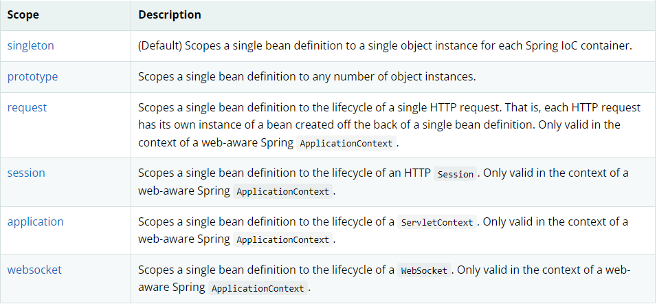
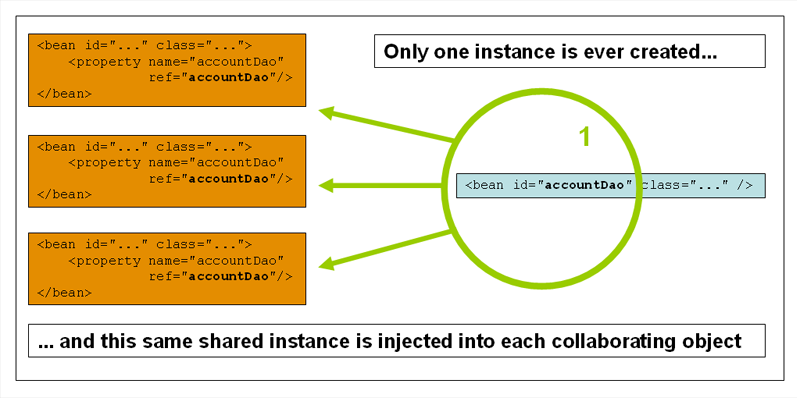
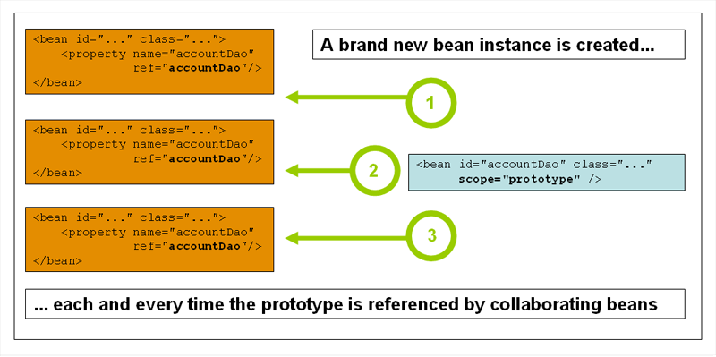
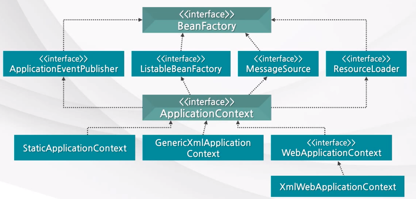

**IOC, DI, AOP🤔  
무슨 말이지?
중요한 개념이니 한번 보고 가세요😆**

*IOC와 DI는 밀접한 관련이 있다*

## IOC (제어 역전)
* 객체 생성, 라이프사이클을 개발자가 아닌 스프링 컨테이너에게 맞기게 됩니다.
* 객체 관련 제어권이 컨테이너에게 있다 보니 DI(의존성 주입)이 가능하게 됩니다.

 *스프링 컨테이너*

### 컨테이너
* 컨테이너는 객체의 라이프사이클을 관리하고 생성된 인스턴스들에게 추가적인 기능을 제공하는 것이다
* 간단히 말하면 객체관리를 하는 그릇이라고 할 수 있다
* 여기서 말하는 객체를 우리는 bean이라고 부른다
   
#### Bean
 * 스프링 컨테이너가 관리하는 자바 객체 (POJO)를 의미
 * 컨테이너에 공급하는 XML파일에 의해 생상된다
 * 어플리케이션의 객체가 지정되면, 해당 객체는 getBean() 메소드로 가져올 수 있다.

#### 스프링 Bean Scope

*  bean이 관리되는 범위를 뜻한다.
*  기본적으로 싱글톤(Singleton)화 시켜서 관리한다    


*  singleton은 한 IOC 컨테이너에 오직 하나만 생성되는 기본적인 scope이다. 


*  prototype은 모든 요청에서 새로운 객체를 생성하는 것이다.
*  즉, 하나의 bean에 다수의 객체가 존재 가능하다.

### 컨테이너 종류

1. Beanfactory  
  *객체를 생성하고, 의존관계를 맺어주는 역할을 하는 스프링 컨테이너 최상위 인터페이스이다*
   - Bean을 등록, 생성, 조회, 반환 관리를 한다
   - Bean을 조회할 수 있는 getBean() 메소드가 정의되어 있다. 
2. ApplicationContext
   - 기본적인 Beanfactory의 기능은 가지고 있다
   - 스프링의 각종 부가 기능을 추가로 제공한다.
  
#### 차이점
  -   beanfactory는 지연로딩(lazy-loading) 방식인 반면 applicationcontext는 사전로딩(pre-loading) 방식이다
  -   지연로딩은 해당 Bean을 호출 할 때 비로소 Bean이 인스턴스화 되므로 많은 bean이 등록되어 있다면 시간이 오래걸린다.
  -   사전로딩은 해당 bean과 관련된 설정등을 컨테이너에서 로드 했을 때 인스턴스화가 되어 호출할 때는 이미 인스턴스화가 되어 있으므로 바로 호출 할 수 있다.

## DI (의존성 주입)
* 스프링 컨테이너로부터 객체를 주입 받는 것 (bean)
* 직접 생성하는게 아니기 때문에 의존성이 낮아지고 유연성이 높아진다.

     
*아니 근데 의존성, 의존.. 이게 무슨 말이야...?*   
   
### 의존 관계
"A가 B를 의존한다"라는 말은 B가 변하면 A도 영향을 받는다는 것이다.
예를 들어 커피 레시피가 바뀌게 되면 바리스타들은 그에 따라야 한다. 고로 *바리스타는 커피에 의존한다.*

### 의존성이 낮아지는 이유
```java
class A {
   private B b;
   public A() {
      b = new B();
   }
}
A a = new A();
```
이 코드는 DI가 적용되지 않은 코드이다.
여기서 클래스 B가 바뀐다면 클래스 A도 수정을 해야하는 불편함이 있다. 즉 B가 변하면 A도 변해야 하므로 의존성이 높다고 할 수 있다.

```java
class A {
   private B b;
   
   public A() {};
   public void setB (B b) {
      this.b = b;
   }
}
```
이 코드는 DI가 적용된 코드이다.
클래스 B가 변한다고 하더라도 클래스 B만 수정하여 클래스 A에 전달하면 된다. 고로 의존성이 낮다고 할 수 있다.

### IOC, DI의 장점
1. 객체 간 의존성을 줄여 유연한 코드 작성을 가능하게 한다
   - DI(의존성 주입)으로 인해 외부에서 객체를 받기 때문에 의존 관계가 줄어든다
2. 유지보수에 용이하다
   - 코드를 바꿔야 할 일이 생겼을 때 전체가 아닌 일부 코드만 바꾸어도 해결 할 수 있다.
3. 코드가 단순해진다
   - IOC가 대부분 해주기 때문에 개발자는 순수 로직에만 집중 할 수 있다.

### 3) 생성 방법
1. 생성자 (가장 권고되는 방법이다)
```java
   public class {
    private B b;
    @Autowired
    public A(B b) {
        this.b = b;
    }
    public void printHello() {
        this.b.hello();
    }
   }
```    
2. 필드 주입 (좋지 않은 방법이다)
 > 필드 (field)란 클래스 내부 멤버를 뜻한다  
```java
   public class {
    @Autowired
    private B b;
    public void printHello() {
        this.b.hello();
    }
   }
```
3. setter 메소드
```java
   public class {
    private B ;
    
    @Autowired
    public void setB(B b) {
        this.b = b;
    }
    public void printHello() {
        this.b.hello();
    }
   }
```

*필드 주입은 왜 좋지 않은 방법이지...?*
이 셋 중에 가장 간단하고 쉬워보이는 방법이다. 하지만 코드를 실행하고자 하면 
> Field injection is not recommended … **Always** use constructor based dependency injection in your beans   

이런 메세지가 나온다. 생성자 주입을 권하는 이유가 무엇일까

### 생성자 주입의 장점   
  * 순환참조를 사전에 방지할 수 있다.   
     *  만약 코드를 잘못 작성하거나 필드주입 혹은 setter주입으로 A와 B가 서로를 참조하는 코드를 작성했다고 하자. 생성자 주입 방식이 아니라면 서로를 계속 참조하게 되어 `stackoverflow`가 발생할 것이다. 그러나 생성자 주입을 사용하면 `BeanCurrentlyInCreationException`라는 오류가 발생하며 실행조차 되지 않을 것이다.    
     ```java
     public class Aservice {
      @Autowired // bService의 의존성이 필요한 곳에 주입 받겠다는 것
      private BService bService;
      public void HelloA() {
         bService.HelloB();
      }
     }

     public class BService {
      @Autowired
      private AServicce aService;
      public void HelloB() {
         aService.HelloA();
      }
     }
     ```
     이 경우 순환참조가 생겨 `stackoveerflow` 발생한다. 그러나 프로그램이 실행되도 이 코드가 실행되지 않는다면 오류가 발생하지 않아 알아차리가 어렵다.    
     그러나 생성자 주입을 이용하면 
     ```java
     class A {
      @Autowired
      public A(B b) {
         this.b = b;
      }
     }

     class B {
      @Autowired
      public B(A a) {
         this.a = a;
      }
     }
     ```
     *주입하려는 빈을 먼저 찾고, 주입하여 빈을 생성하므로*
     A를 만들려면 B를 찾아야 하고 B를 만들려면 A를 찾아야 하므로 `BeanCurrentlyInCreationException`를 발생시켜 알려준다. 
   *  불변성(Immutability)를 가질 수 있다.
      * 필드에 final을 선언하려면 인스턴스가 생성될 때 final이 붙은 필드를 초기화해야 한다. 그러니 필드나 setter는 인스턴스가 생성된 이후 DI가 진행되
   *  필수적인 의존성이 없다면 인스턴스를 생성할 수 없도록 강제하고 있다.
   *  SRP(단일 책임의 원칙)을 위반할 확률이 줄어든다
      * SRP란
         >소프트웨어 모듈은 변경의 이유가 단 하나이어야만 한다.    

         생성자 주입을 사용하면 생성자에 전달해야 하는 인자를 모두 넣어줘야 하기 때문에 위반할 여지가 줄어든다. 
   * 테스트하기 쉽다.
     * 필드 주입을 사용하는 경우 개발자가 직접 필드에 주입을 할 수 없게 된다. spring이 알아서 주입을 하기 때문이다.


<hr>

### 참조
-  https://gmlwjd9405.github.io/2018/11/10/spring-beans.html
-  https://docs.spring.io/spring-framework/docs/current/reference/html/core.html#beans-factory-scopes
-  https://shanepark.tistory.com/368

<hr>
