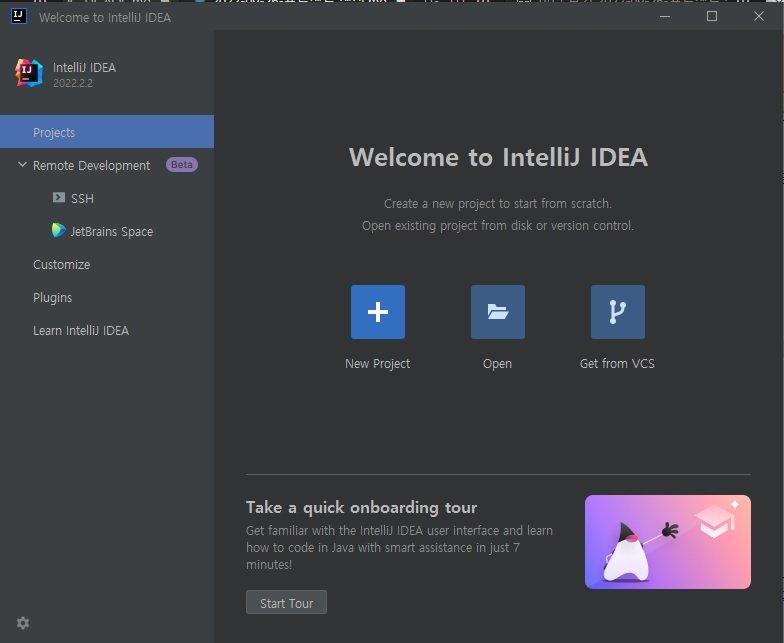
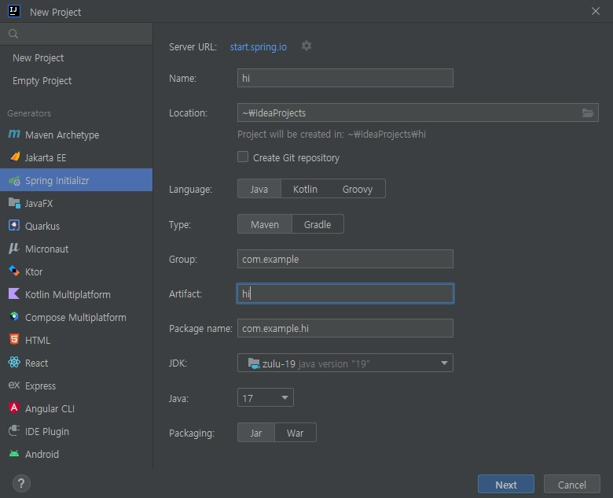
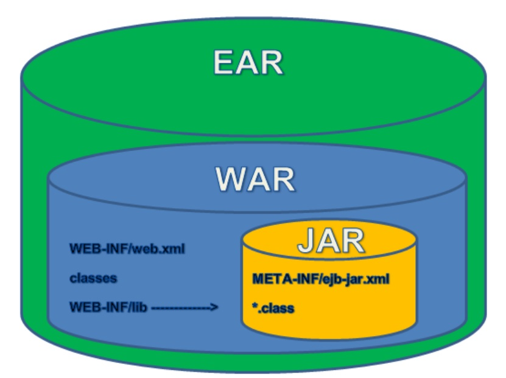
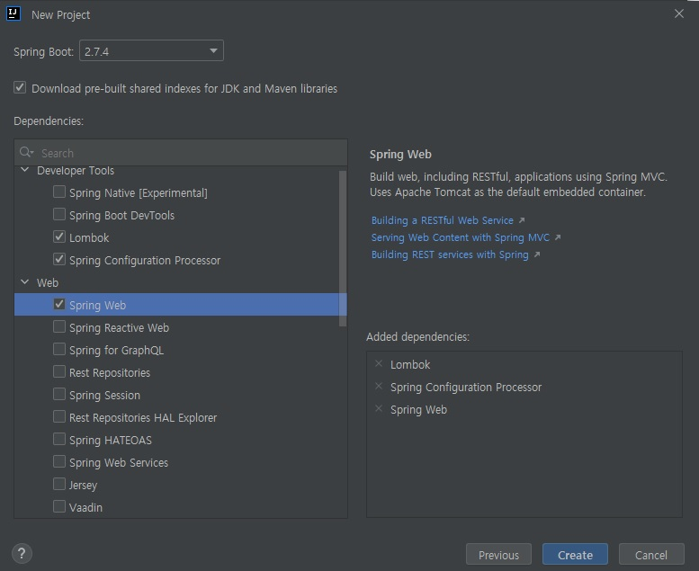
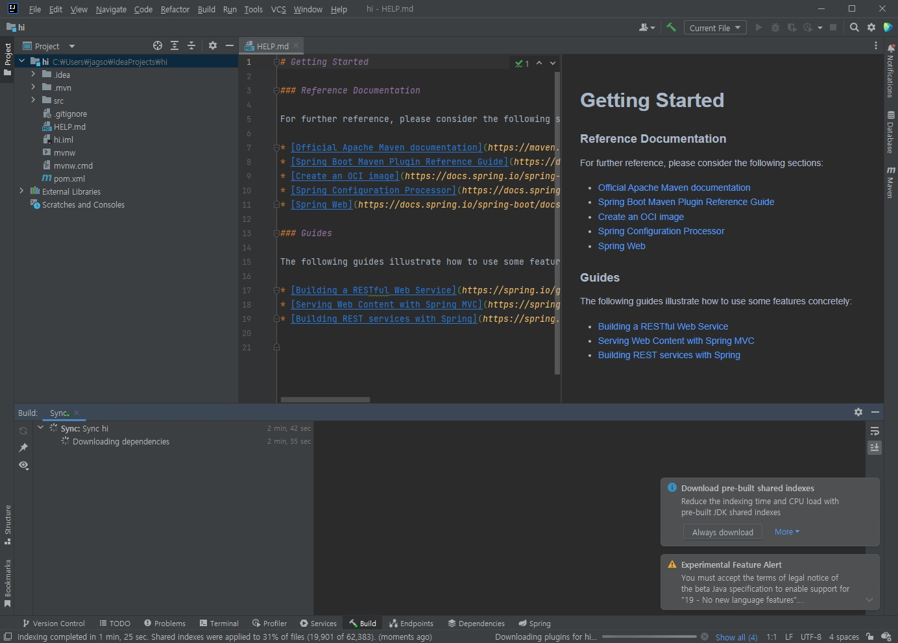
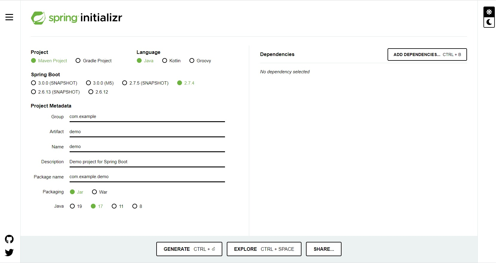
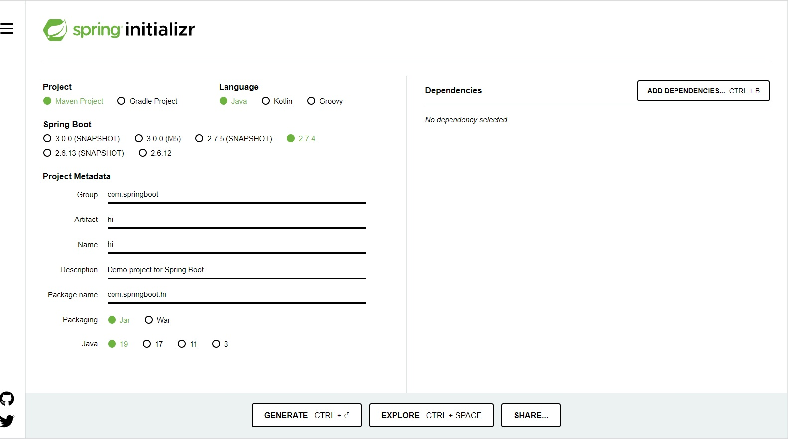
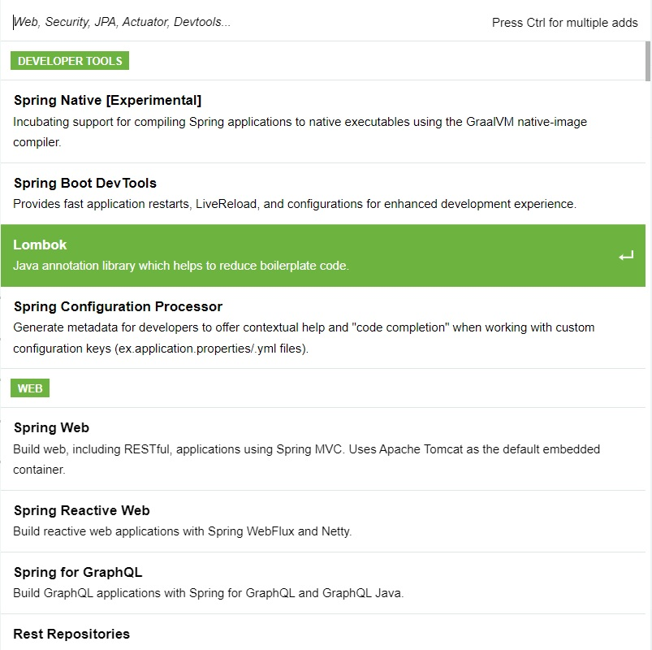

## 프로젝트 생성 방법
1. 인텔리제이 IDEA에서 프로젝트 생성하기
> 물론 이클립스로 해도 상관 없습니다. 하지만 저는 인텔리제이 얼티밋 버전이 있어서 이걸로 해보겠습니다

[new project]를 눌러줍시다

* Name : 프로젝트의 이름을 설정합니다. 
* Location : 프로젝트를 생성할 위치를 설정합니다.
* Language : JVM상에서 동작하는 언어를 선택합니다.
* Type : 빌드 툴을 선택합니다. 각자 익숙한 것을 선택하는 걸 추천합니다.
* Group : 이 프로젝트를 정의하는 고유한 식별자 정보인 그룹을 설정합니다.
* Artifact : 세부 프로젝트를 식별하는 정보를 기입합니다.
* Package name : Group과 Artifact를 설정하면 자동으로 입력됩니다.
* Project SDK, JAVA : 11버전으로 선택합니다
* Packaging : 애플리케이션을 쉽게 배포하고 동작하게 할 파일들의 패키징 옵션입니다.

### JAR와 WAR

* .jar .war 모두 압축 파일로, 애플리케이션을 간단히 배포하고 어느 환경에서나 구동시킬 수 있도록 소스들이나 관련 파일들을 하나로 패키징 한 것이다.
* **JAR**
  - Java Archive
  - 여러개의 자바 클래스 파일과 관련 리소스, 데이터를 하나의 파일로 압축한 것이다.
  - JRE나 JDK를 이용하여 실행시킬 수 있다.
  - 스프링부트는 내장 톰캣을 포함하고 있기 때문에 간단하게 JAR 배포만으로 실행이 가능하다. (보통 클라우드에서 사용된다)
* **WAR**
  - Web application Archive
  - 별도의 웹 서버 또는 WAS(톰캣)가 있어야 프로젝트 구동이 가능하다.
  - 웹 관련 자원(JSP, SERVLET, HTML, XML 등)만 포함하고 있다

여기서는 프로젝트에서 사용할 의존성을 추가합니다. 초기에 추가할 수 있고 진행하면서도 추가 할 수 있습니다. 이번에는 기본적인 의존성을 위 그림과 같이 선택하도록 하겠습니다.

다 되었다면 위와 같은 그림이 나올 것입니다.

1. 스프링 공식 사이트에서 프로젝트 생성하기
> 인텔리제이 IDEA가 커뮤니티 버전이라면 이 방법으로 하는 것이 좋습니다. 스프링 공식 사이트에는 스프링 부트 프로젝트를 자동으로 만들어 주는 서비스가 있습니다.

https://start.spring.io
위 링크로 들어가면 아래와 같은 화면이 나옵니다

   
우선 각 항목을 다음과 같이 설정하겠습니다
Product : Maven Project
Language : Java
Spring Boot : 2.5.6 (없다면 최신 버전으로 해도 괜찮아요)
Project Metadata
 - Group : com.springboot
 - Artifact : hi
 - Name : hi
 - Description (자유롭게 적어도 돼요) : Demo project for Spring Boot
 - Package Name (자동완성) : com.springboot.hi
 - Packaging : Jar
 - Java : 11 (최신버전 ok)

그리고 Dependencies 항목을 채우기 위해 [ADD DEPENDENCES...] 버튼을 누릅니다.
아래 창에서 
*  Lombok
*  Spring Configuration Processeor
*  Spring Web
을 선택합니다

이후 사이트 하단의 [GENERATE] 버튼을 누른 뒤 프로젝트를 내려 받습니다. 그 다음 인텔리제이 IDEA를 실행하고 압축을 푼 프로젝트를 선택해 열면 끝입니다.