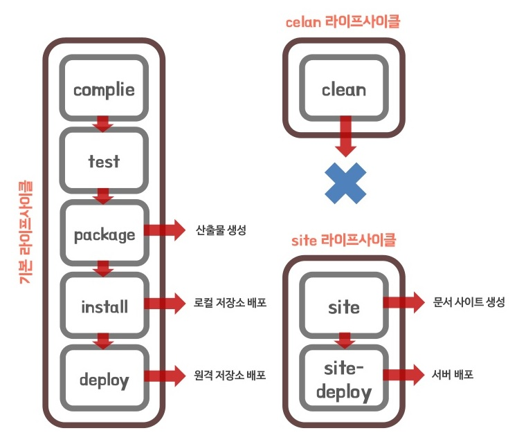

# pom.xml 살펴보기

## pom.xml
이 파일은 메이븐의 기능을 사용하기 위해 작성하는 파일입니다. 프로젝트, 의존성 라이브러리, 빌드 등 해당 프로젝트를 관리하는데 필요한 내용이 있습니다.

### 필드 관리 도구
JVM이나 WAS가 프로젝트를 인식하고 실행 할 수 있도록 우리가 프로젝트에 사용한 파일들 (.xml .jar .properties)를 빌드하는 도구이다. 규모가 커질수록 라이브러리는 커지고 라이브러리 간 버전 호환성을 체크해야 하는 어려움이 있지만 이 도구를 이용하면 해결 할 수 있다.

## 메이븐
* 자바 프로젝트를 빌드하고 관리하는 도구
* pom.xml에 필요한 라이브러리를 추가하면 **해당 라이브러리에 필요한 라이브러리까지 함께 내려받아 준다**

### 메이븐 기능
* 프로젝트 관리 : 프로젝트 버전과 아티팩트를 관리
* 빌드 및 패키징 : 의존성을 관리하고 설정된 패키지 형식으로 빌드를 수행
* 테스트 : 빌드를 수행하기 전에 단위 테스트를 통해 작성된 어플리케이션 코드의 정상 동작 여부를 확인
* 배포 : 빌드가 완료된 패키지를 원격 저장소에 배포
* 간단히 말해서 소스코드를 컴파일하고 배포하는 것을 도와준다

### 메이븐 생명 주기

1. 클린 생명주기
   - clean : 이전 빌드가 생성한 모든 파일을 제거
2. 기본 생명주기
   - validate : 프로젝트를 빌드하는 데 필요한 모든 정보를 사용할 수 있는지 검토
   - compile : 프로젝트의 소스코드를 컴파일
   - test : 단위 테스트 프레임워크를 사용해 테스트 실행
   - package : 컴파일한 코드를 가져와서 JAR 등의 형식으로 패키징을 수행
   - verify : 패키지가 유효하며 일정 기준을 충족하는지 확인
   - install : 프로젝트를 사용하는 데 필요한 패키지를 로컬 저장소에 설치
   - deploy : 프로젝트를 통합 또는 릴리스 환경에서 다른 곳에 공유하기 위해 원격 저장소에 패키지를 복사
3. 사이트 생명주기
   - site : 메이븐의 설정 파일 정보를 기반으로 프로젝트의 문서 사이트 생성
   - site - deploy : 생성된 사이트 문서를 웹 서버에 배포