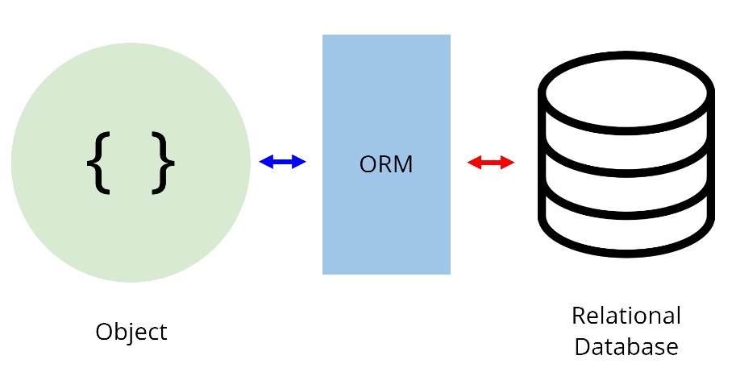
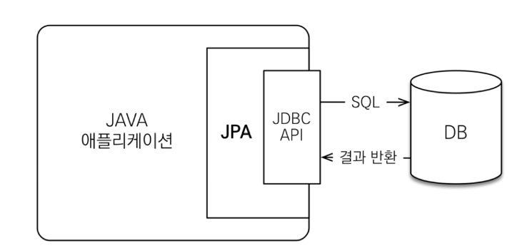
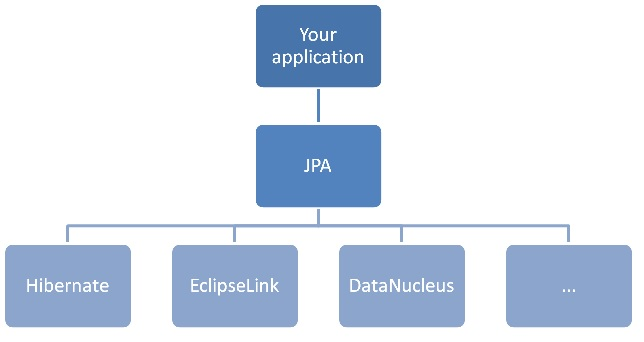
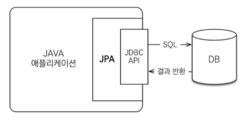
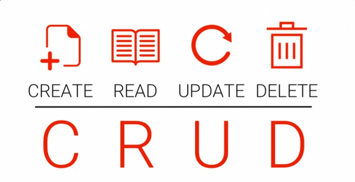

# 하이버네이트

## 하이버네이트
하이버네이트란 자바의 ORM 프레임워크로, JPA가 정의하는 인터페이스를 구현하고 있는 JPA 구현체 중 하나이다. 

### ORM
Object Relational Mapping의 줄임말로 객체 관계 매핑을 의미한다. 우리가 사용하는 객체(클래스)는 데이터베이스 테이블과 매핑하기 위해 만들어진 것이 아니기 때문에 일치하지 않는 것들이 존재한다.    
**고로 ORM은 객체(클래스)와 데이터베이스 테이블을 매핑하는 것이다.** 

*이를 이용하면 쿼리문을 직접 적지 않아도 된다.*

### JPA
자바에서의 ORM 기술 표준으로 채택된 인터페이스의 모음이다. 라이브러리가 아니므로 특정 기능을 하지는 않는다. 

내부적으로 JDBC라는 것을 사용한다.

JPA의 구현체는 위 그림과 같이 세가지가 있는데 그 중에 하나가 바로 가장 많이 쓰인다는 하이버네이트이다. 

### JDBC
자바 프로그램이 DB와 데이터를 주고 받을 수 있게 해주는 프로그래밍 인터페이스이다.
이를 사용할 경우 다양한 DB에 접근이 가능해지고 그 DB의 사용법을 몰라도 JDBC를 알면 기본적이 데이터 조작이 가능해진다.

### SPRING DATA JPA
   
JPA를 편리하게 사용할 수 있도록 지원하는 spring 모듈 

* 하이버네이트와 같은 구현체를 좀 더 쉽게 사용할 수 있도록 추상화한 것
* CRUD 처리에 필요한 인터페이스 제공
* 하이버네이트의 EntityManager을 직접 다루지 않고 Repository를 정의해 사용함으로써 스프링이 적합한 쿼리를 알아서 생성하는 방식으로 데이터를 조작
* 물론 Repository 인터페이스를 정의하지 않고 EntityManager를 사용해 Persistance Layer를 구현할 수 있지만 많이 복잡하지만 Repository를 이용하면 spring이 알아서 해줌

### CRUD
기본적인 데이터 처리 기능인 **'CREATE, READ, UPDATE, DELETE'**를 묶어서 일컫는 말이다.
