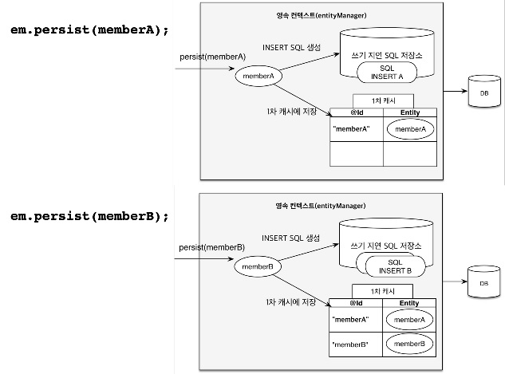

## 영속성 컨텍스트
* *엔티티를 영구 저장하는 환경*
* 어플리케이션과 DB사이에서 객체를 보관하는 가상의 DB같은 역할

### 엔티티 (Entity)
DB상에서 데이터를 관리하는 대상
ex) 상품, 회사, 직원 등과 같이 *명사이면서 업무와 관련된 데이터*를 **엔티티**로 함

### 엔티티 메니저 (EntitiyManager)
* 여러 Entity 객체들을 관리하는 역할
* EntityManagerFactory에서 요청이 올 때마다 EntityManager을 생성
* 요청당 하나씩 생성해서 할당 (Thread not safe하기 때문에 여러 스레드가 동시에 접근하면 동시성 문제 발생) (SpringContainer는 proxy패턴을 통해서 주입해줌으로써 Thread safe를 보장)

### 엔티티 생명주기
* 비영속
  영속성 컨텍스트에 추가되지 않은 상태
  ```java
    Member member = new Member();
    member.setId("member1"); 
    member.setUsername("회원1");
  ```
* 영속
  영속성 컨텍스트에 저장되어 관리되고 있는 상태
  ```java
    // 엔티티 매니저를 통해 영속성 컨텍스트에 엔티티를 저장
    em.persist(entity);
  ```
* 준영속
  영속성 컨텍스트에서 관리되다가 분리된 상태
  ```java
    // 엔티티를 영속성 컨택스트에서 분리
    em.detach(entity);
    // 영속성 컨텍스트를 비우기
    em.clear();
    // 영속성 컨택스트를 종료
    em.close();
  ```
* 삭제
  영속성 컨텍스트에 삭제 요청을 한 상태
  ```java
    em.remove(entity)
  ```

## 영속성 컨텍스트의 이점
1. 1차 캐시
   * 엔티티 조회시 1차 캐시에 데이터가 있는지 탐색 후 있으면 리턴
   * 없으면 데이터베이스에 접근해서 탐색 후 바로 리턴하는 것이 아니라 다음 탐색에서 재사용 할 수 있도록 1차 캐시에 저장
   * EntityManager는 트랜잭션 단위이므로 끝나면 1차 캐시도 지워짐 (아주 찰나의 순간에만 장점)
2. 동일성 보장
3. 트랜잭션을 지원하는 쓰기 지연
   * *query를 commit하는 시점에 날릴 수 있응*
    
   * persistence.xml 파일에 
    <property name="hibernate.jdbc.batch_size" value="10"/>
    이라는 옵션을 주게되면 쿼리를 한번에 날려버릴 수 있어서 최적회 가능
4. 변경 감지