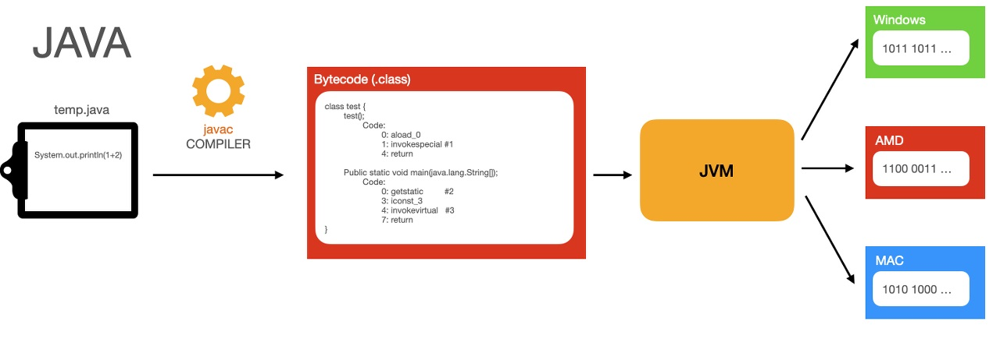
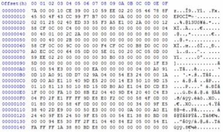
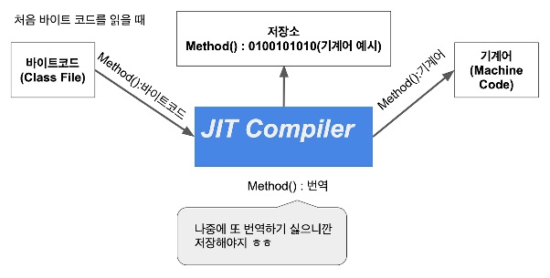
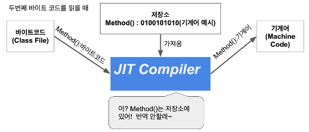
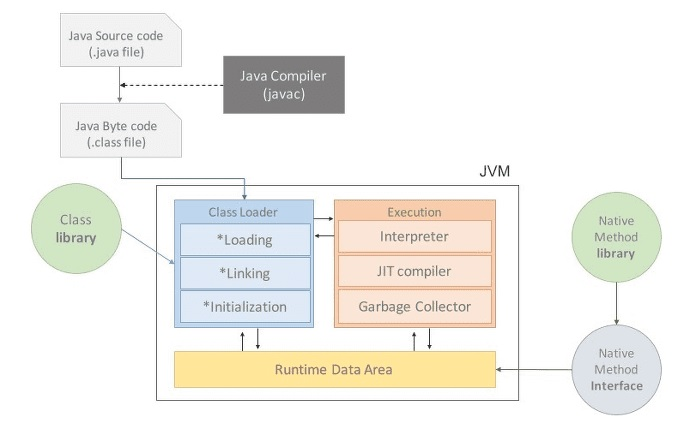

## JVM이란 무엇인가
- Java Virtual Machine의 줄임말 (자바를 실행하기 위한 가상 컴퓨터)
- *JVM 위에서 실행되는 JAVA코드는 OS에 종속받지 않는다*
- **OS에 종속받지 않고** CPU가 JAVA를 인식, 실행할 수 있게 하는 가장 컴퓨터
- ```*.java```는 CPU가 인식할 수 없으므로 ```*.class```로 변환하여 JVM이 인식하게 하고 기계어로 바꾸어 CPU에 전달한다 

## 컴파일 / 실행하는 방법

1. 자바 소스코드(```.java```)를 작성한다
2. 자바 컴파일러가 소스파일을 컴파일한다 (```.java``` -> ```.class``` 바이트코드로 이루어져 있어서 아직은 CPU가 읽을 수가 없다)
3. JVM 인터프리터와 JIT 컴파일러가 바이트코드를 기계어로 변환시킨다
4. 기계어를 실행한다
## 바이트코드란 무엇인가

- *JVM이 이해할 수 있는 저수준 언어이다*
- ```*.java```를 컴파일 한 결과인 ```*.class```는 바이트코드로 이루어져 있다
- JVM만 있다면 어떤 OS에서도 실행 될 수 있다
## JIT 컴파일러란 무엇이고 어떻게 동작하는가
- 초기의 JAVA는 인터프리터 방식만을 이용해서 실행속도가 느렸지만 JIT를 도입해 속도를 보완했다


- **반복적으로 사용되는 코드는 다시 인터프리터를 통해 기계어로 변환되지 않도록 캐시에 넣어서 수행시간을 최적화 시키는데 도움을 준다**

### 컴파일 방식
- 프로그램 전체를 스캔하여 기계어로 번역하는 방식
- 초기 시간이 오래 걸리지만 전체를 놓고 보면 인터프리터보다 빠르다 (초기 스캔을 만들어 놓고 이전에 만들어 놓았던 실행파일을 실행하기 때문)
### 인터프리터 방식
- 프로그램 실행시 한 번에 한 문장씩 번역한다
- 실행 시간은 컴파일 방식보다 오래 걸리지만 메모리 사용에 효율적인 모습을 보인다

## JVM의 구성요소

1. Class Loader
- 클래스 단위로 구동되는 특징을 구현하는 기능인 동적 클래스 로딩을 구현하는 구성요소이다.
- 
1. Execution Engine
2. Runtime Data Area 